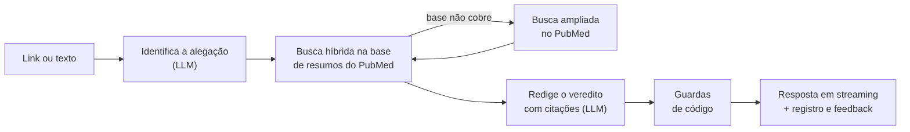

# Verdade ou Fake? — Checagem de Alegações de Saúde com Evidência Científica
**Challenge 1** - Equipe Megatron - Sistemas de Machine Learning 2026/02

📖 **[Documentação completa](https://unb-sistemas-de-machine-learning.github.io/challenge_1_megatron/)**

🚀 **Demo:** <https://verdade-ou-fake-megatron.chilecentral.cloudapp.azure.com>

## O que é

Plataforma web onde o usuário **cola o link de uma notícia ou um texto** (uma corrente
de WhatsApp, uma alegação curta) sobre medicamentos e tratamentos e recebe um veredito
em linguagem simples, com **as fontes científicas citadas**: resumos de estudos do
PubMed, com link para cada um.

Vereditos possíveis: *tem respaldo científico*, *a ciência contradiz*, *há base, mas a
alegação exagera*, *evidência insuficiente ou conflitante*, *não foi possível verificar*
e *fora do escopo*. Cada resposta traz um nível de confiança.

O escopo é restrito a **medicamentos, tratamentos e terapias**. Não cobre diagnóstico
individual nem recomendação personalizada.

## Como funciona

O sistema é um RAG (*Retrieval-Augmented Generation*) servido por FastAPI, com a resposta
chegando aos poucos (streaming).



1. Se a entrada é um link, o sistema extrai o texto da página (com proteção contra SSRF).
2. Um LLM identifica a alegação e a traduz para uma consulta científica em inglês.
3. A busca híbrida (vetorial exata + BM25, fundidas por Reciprocal Rank Fusion, com bônus
   para revisões sistemáticas, meta-análises e ensaios randomizados) acha os estudos
   mais próximos na base.
4. Se a base local não cobre a alegação, o sistema consulta o PubMed na hora. Os
   artigos achados entram na base.
5. O LLM redige o veredito **usando só essas fontes**, com citações `[n]`.
6. Guardas em código conferem a saída: citação inexistente é removida, veredito
   afirmativo sem citação é rebaixado, e a confiança não passa do que o tipo de estudo
   citado sustenta.
7. A consulta é registrada (veredito, fontes, latência, modelo) e o usuário pode dar
   feedback.

Sem chave de LLM, ou com o provedor fora do ar, o sistema roda em modo degradado: mostra
as fontes recuperadas, sem redigir o veredito.

O BERTimbau treinado pelo grupo continua no repositório como **sinal secundário
opcional** ("sinal de estilo do texto"), desligado por padrão e ligado com
`VOF_SINAL_ESTILO=1`. Ele não decide o veredito. Detalhes, decisões e a história da versão
anterior em [Arquitetura](docs/arquitetura.md).

## O que mudou em relação à primeira versão

| | Antes | Depois |
|---|---|---|
| Entrada | Só link | Link, texto colado ou alegação curta |
| Cobertura | 38 termos de um dicionário | Qualquer alegação de saúde, com busca ampliada no PubMed |
| Evidência | PubMed consultado a cada pergunta | Base local de 1.069 resumos, atualizada toda semana |
| Decisão | NLI zero-shot + regras | LLM restrito às fontes + guardas em código |
| Resposta | Rótulo e lista de artigos, só no fim | Veredito e explicação com citações, em streaming |
| Banco de dados | Nenhum | SQLite com base, consultas, feedback e cache |
| Hospedagem | Túnel temporário a partir do Colab | VM no Azure com endereço fixo, HTTPS e disco persistente |

Com o Groq, a resposta completa leva cerca de 1,5 s na mediana, e o conjunto de 20
alegações com gabarito teve 20 acertos (detalhes e ressalvas em
[Avaliação](docs/avaliacao.md)). Comparação completa, benefícios, custos
da mudança e o comportamento em cada situação em
[Antes e depois](docs/antes-e-depois.md).

## Stack

Python 3.11 · FastAPI + SSE · SQLite (FTS5) + numpy · fastembed (ONNX,
`paraphrase-multilingual-MiniLM-L12-v2`) · LLM por API compatível com OpenAI (Groq por
padrão; Gemini ou Ollama) · trafilatura · PubMed E-utilities · Docker · Caddy · Azure
(VM) · GitHub Actions · MkDocs

## Como rodar

### Local

```bash
python3.11 -m venv venv && source venv/bin/activate
pip install -r requirements.txt
cp .env.example .env        # e preencha LLM_API_KEY (chave gratuita em console.groq.com)
python scripts/constroi_base.py
PYTHONPATH=src uvicorn verdade_ou_fake.api:app --port 7860
```

Abra <http://localhost:7860>. `scripts/constroi_base.py` indexa `dados/base/pubmed.jsonl`
no banco SQLite (cerca de 70 s em CPU para a base atual).

### Docker

```bash
docker compose up --build
```

O Dockerfile constrói o banco no build e sobe o uvicorn na porta 7860. O perfil
opcional `local-llm` do `docker-compose.yml` sobe também um Ollama.

### Testes

```bash
pip install -r requirements-dev.txt --extra-index-url https://download.pytorch.org/whl/cpu
pytest -m "not rede"
```

### Dependências

| Arquivo | Conteúdo |
|---|---|
| `requirements.txt` | Só o runtime leve do serviço |
| `requirements-treino.txt` | PyTorch e afins, para treinar o classificador opcional |
| `requirements-dev.txt` | Testes |

## Configuração do LLM

O LLM é qualquer servidor compatível com a API de chat da OpenAI. Trocar de provedor é
trocar variáveis de ambiente (no `.env`), sem mexer no código. Troque também
`LLM_MODELOS` e `LLM_MODELO_RAPIDO`, que trazem nomes de modelos do Groq por padrão.

| Provedor | `LLM_BASE_URL` | `LLM_API_KEY` |
|---|---|---|
| Groq (padrão) | `https://api.groq.com/openai/v1` | chave de console.groq.com |
| Gemini | `https://generativelanguage.googleapis.com/v1beta/openai` | chave do AI Studio |
| Ollama (local) | `http://localhost:11434/v1` | `ollama` |

`LLM_MODELOS` é uma lista separada por vírgulas, tentada em ordem: se um modelo estoura
a cota (HTTP 429), o próximo assume. Limites dos planos gratuitos **na data da consulta
(07/10/2026), sujeitos a mudança**: no Groq, os três modelos de chat disponíveis (`openai/gpt-oss-120b`, `qwen/qwen3.8-27b` e `openai/gpt-oss-20b`) têm, cada um, 8.000 tokens por minuto e 1.000 requisições por dia, lidos dos cabeçalhos de resposta da API. Uma consulta gasta cerca de 2.500 tokens, então cada modelo aguenta umas três consultas novas por minuto; a lista com fallback soma os três. Gemini: modelos Flash no
plano gratuito, com limites por projeto exibidos no AI Studio.

Todas as variáveis de ambiente estão na tabela de [Operação](docs/operacao.md).

## Deploy

O app roda numa máquina virtual do Azure, paga com o crédito do **Azure for Students**:
<https://verdade-ou-fake-megatron.chilecentral.cloudapp.azure.com>

```bash
az login --use-device-code
ROTULO=verdade-ou-fake-megatron LOCAL=chilecentral TAMANHO=Standard_B2ats_v2 scripts/publica_azure.sh
```

O script cria a máquina se ela não existir, constrói a imagem, envia para a VM e sobe
dois contêineres: o serviço e um proxy Caddy, que emite o certificado HTTPS. Rodar de
novo publica uma versão nova sem perder os dados: o banco fica num volume no disco da
VM, então consultas, feedback e artigos da busca ampliada sobrevivem a reinícios.

A hospedagem gratuita no Hugging Face Spaces, planejada no início, deixou de existir
para contêineres Docker. Passo a passo e custos em [Operação](docs/operacao.md); a
decisão está no [ADR 0008](docs/adr/0008-hospedagem.md).

## Temas em alta

A página inicial mostra os temas de saúde da semana, já checados. Eles vêm de uma
planilha do Google Sheets mantida pela equipe e das manchetes de saúde do Google
Notícias. Para cada tema o sistema busca estudos no PubMed e os acrescenta à base, de
modo que as respostas sobre o que está em pauta melhoram e saem do cache. O texto das
notícias não entra na base, que guarda só evidência científica. Configuração em
[Operação](docs/operacao.md) e decisão no [ADR 0010](docs/adr/0010-temas-em-alta.md).

## Como a base se atualiza

`scripts/ingere_pubmed.py` busca no PubMed, para cada medicamento e cada par
medicamento × condição do vocabulário, revisões sistemáticas, meta-análises e ensaios
randomizados (sem estudos só em animais). O resultado é `dados/base/pubmed.jsonl`
(1.069 resumos na versão atual), versionado no git, com `dados/base/manifesto.json`
(data, volume, SHA-256). O workflow `ingestao-base.yml` repete a ingestão toda semana e
commita a base atualizada. `scripts/constroi_base.py` deriva do JSONL o banco SQLite com
os embeddings. Quando uma alegação não é coberta, a busca ao vivo no PubMed traz estudos
novos para a base.

## Endpoints

| Método e caminho | Função |
|---|---|
| `POST /api/analisar` | Analisa uma alegação; resposta em Server-Sent Events |
| `POST /api/feedback` | Registra o feedback do usuário sobre uma resposta |
| `GET /api/saude` | Estado do serviço e versão da base |
| `GET /api/metricas` | Latência, vereditos, cache, busca ao vivo e feedback |

Contrato dos eventos e exemplos de `curl` em [API](docs/api.md).

## Limitações

- O LLM pode errar mesmo com as guardas: elas impedem citação inexistente e afirmação
  sem fonte, mas não garantem que a fonte sustente a frase. Confira os links.
- A base cobre bem só os temas do vocabulário (23 medicamentos e 15 condições). Fora
  dele, a qualidade depende da busca ao vivo.
- A base é de resumos em inglês, não de textos completos, e herda o viés de publicação.
- O sistema não verifica imagens, vídeos nem áudio.
- Depende de cota gratuita de terceiros (LLM, PubMed, hospedagem).
- Quando não há estudo sobre a alegação, responde "não foi possível verificar", nunca
  "é falso": ausência de evidência não é evidência de ausência.
- Os números de qualidade do sistema (latência, acurácia do veredito) são medidos por
  `scripts/avalia_rag.py`; os resultados ficam em [Avaliação](docs/avaliacao.md).

## Documentação

| Documento | Conteúdo |
|---|---|
| [Arquitetura](docs/arquitetura.md) | Fluxo, componentes, MLOps, requisitos não funcionais, o que mudou |
| [Antes e depois](docs/antes-e-depois.md) | Diferenças entre a arquitetura antiga e a nova, benefícios e comportamento atual |
| [Avaliação](docs/avaliacao.md) | Medições do sistema |
| [API](docs/api.md) | Endpoints e eventos de streaming |
| [Operação](docs/operacao.md) | Variáveis, deploy, atualização da base, monitoramento |
| [Dados](docs/dados.md) | Datasheets da base de conhecimento e do corpus de treino |
| [ADRs](docs/adr/index.md) | Decisões de arquitetura |
| [Guiding Questions](docs/guiding-questions.md) | Perguntas norteadoras do projeto |
| [Canvas](docs/canva.md) | Objetivos de negócio e de ML, escopo |

## Classificador opcional (BERTimbau)

Só é necessário para o sinal de estilo. Use `requirements-treino.txt`.

```bash
python scripts/prepara_dataset.py       # recorte de saúde do Fake.br
python scripts/treina_modelo.py         # baseline TF-IDF + modelos/cards/baseline.json
python scripts/treina_bert.py           # BERTimbau + modelos/cards/bertimbau.json
python scripts/verifica_gate.py modelos/cards/bertimbau.json   # gate de qualidade
python scripts/publica_modelo.py <usuario>/bertimbau-saude     # pesos para o Hub
```

O modelo só é carregado se o model card estiver em `"status": "producao"` e o hash dos
pesos bater com o registrado. A promoção a `producao` é manual.

## Aviso
Este sistema é apenas informativo e **não substitui orientação médica**. As respostas
são uma síntese de evidências públicas, não uma prescrição.

## Equipe
<div align="center">
   <table style="margin-left: auto; margin-right: auto;">
        <tr>
            <td align="center">
                <a href="https://github.com/eduardoferre">
                    
                    <h5 class="text-center">Eduardo Ferreira <br>221008632</h5>
                </a>
            </td>
            <td align="center">
                <a href="https://github.com/PedroMoraes39">
                    
                    <h5 class="text-center">Pedro Henrique Caldeira <br>190036427</h5>
                </a>
            </td>
            <td align="center">
                <a href="https://github.com/R1K4S">
                    
                    <h5 class="text-center">Ricardo Henrique Silva <br>231037727</h5>
                </a>
            </td>
            <td align="center">
                <a href="https://github.com/Vitorlustosa">
                    
                    <h5 class="text-center">Vitor Guilherme <br>232014342</h5>
                </a>
            </td>
    </table>
</div>

## Disciplina

Sistemas de Machine Learning — UnB/FCTE — Profs. Isaque Alves e Guilherme Fernandes — 2026/2
