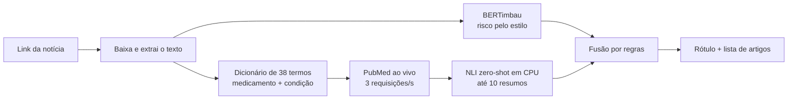
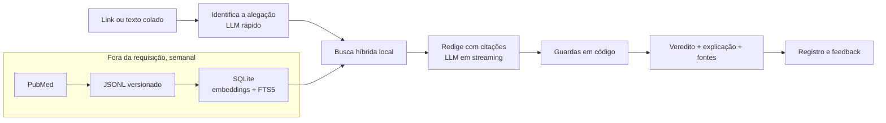

# Antes e depois

O que mudou entre a primeira versão do sistema e a atual, o que a mudança trouxe e como
o projeto se comporta hoje. A história de por que a primeira versão falhou está em
[Arquitetura](arquitetura.md#o-que-mudou-e-por-que); esta página é a comparação.

## Os dois desenhos

**Antes: duas camadas e fusão por regras.** Todo o trabalho pesado acontecia dentro da
requisição do usuário.

**Depois: RAG.** O trabalho pesado sai da requisição e vai para a ingestão em lote. Na
hora da consulta sobram uma busca local e duas chamadas ao LLM.

## Comparação

| Aspecto | Antes | Depois |
|---|---|---|
| Entrada aceita | Só link de notícia | Link, texto colado ou alegação curta |
| Como acha a alegação | Dicionário de 38 termos | LLM, com o dicionário como reserva |
| Cobertura | Só pares medicamento + condição do dicionário | Qualquer alegação de saúde; fora da base, busca ampliada no PubMed |
| Onde está a evidência | PubMed consultado a cada pergunta | Base local de 1.069 resumos, atualizada toda semana |
| Como decide | NLI zero-shot + regras de fusão | LLM restrito às fontes + guardas determinísticas |
| O que o usuário recebe | Um rótulo e uma lista de artigos | Veredito, resumo, explicação em linguagem simples com citações clicáveis |
| Papel do BERTimbau | Metade do veredito | Sinal secundário opcional |
| Modelos em memória | BERTimbau e mDeBERTa, com PyTorch | Um modelo de embeddings em ONNX |
| Banco de dados | Nenhum | SQLite: base, consultas, feedback e cache |
| Interface | Streamlit, resposta só no fim | Página estática, resposta em streaming |
| Hospedagem | Túnel temporário a partir do Colab | VM no Azure com endereço fixo, HTTPS e disco persistente |
| Monitoramento | Nenhum | `/api/metricas`: latência, vereditos, feedback, uso de cache |
| Temas em alta | Não existia | Planilha da equipe e Google Notícias, com checagem pronta e base alimentada a cada rodada |
| Atualização dos dados | Não se aplicava | Workflow semanal + artigos da busca ampliada |
| Quando um serviço externo cai | Resposta vazia ou erro | Modo degradado: mostra as fontes sem o veredito |

## Benefícios

**Velocidade.** A versão anterior levava dezenas de segundos por resposta, segundo o
uso da equipe; esse tempo não chegou a ser medido com instrumento. Na versão atual, a
resposta completa com o Groq leva 1,5 s na mediana e 3,8 s no pior caso do conjunto de
avaliação. Sem o LLM, o sistema gasta 83 ms, e a busca na base, cerca de 10 ms. Uma
pergunta repetida vem do cache, sem chamar o LLM.

**Cobertura.** Antes, uma alegação fora dos 38 termos terminava em "não foi possível
verificar". Agora a alegação é entendida em linguagem livre, e a base cresce sozinha:
quando falta cobertura, o sistema busca no PubMed e guarda o que achou.

**Resposta que se pode conferir.** Cada frase da explicação aponta para o estudo de
onde saiu, com link. Citação que não existe é removida antes de chegar à tela, veredito
afirmativo sem citação é rebaixado, e a confiança não passa do que o tipo de estudo
citado sustenta.

**Peso.** A versão anterior precisava de cerca de 1,5 GB de RAM só para os dois
modelos. A atual usa cerca de 630 MB no total, numa imagem de 671 MB que sobe em
segundos, porque o banco já vem construído.

**Operação.** Existe um banco, um registro de cada consulta, um painel de métricas, um
botão de feedback e uma demo com endereço fixo, HTTPS e dados persistentes. Trocar de provedor de LLM é trocar
variáveis de ambiente.

**Testes.** A suíte offline tem 326 testes e roda em cerca de 10 segundos, sem rede e
sem carregar modelo. O fluxo inteiro é testado com um LLM simulado.

### O que a mudança custou

- **Dependência de terceiros.** O veredito depende de um provedor de LLM e da cota
  gratuita dele. A versão anterior rodava só com modelos próprios.
- **Um tipo novo de erro.** Um LLM pode citar uma fonte e dizer o contrário do que ela
  diz. As guardas conferem se a citação existe, não se ela sustenta a frase. No teste
  com um modelo local pequeno isso aconteceu, como está em [Avaliação](avaliacao.md).
- **Qualidade medida num conjunto pequeno.** O sistema acertou os 20 casos do conjunto
  com gabarito, mas o conjunto foi escrito pela equipe e o prompt foi ajustado olhando
  para ele. As ressalvas estão em [Avaliação](avaliacao.md).

## Como o projeto se comporta agora

| Situação | O que o sistema faz |
|---|---|
| Alegação coberta pela base | Mostra a alegação identificada, lista até 5 estudos e redige o veredito em streaming, com citações |
| Alegação fora da base | Avisa que está ampliando a busca, consulta o PubMed, guarda os artigos e segue o fluxo normal |
| Nenhum estudo encontrado | Responde "não foi possível verificar" e explica que ausência de estudo não prova que a alegação é falsa. O LLM não é chamado |
| Texto que não é de saúde | Responde "fora do escopo", sem buscar nem redigir |
| Link que não abre | Explica que a página pode ter paywall ou bloqueio e pede o texto colado |
| Mesma pergunta de novo | Devolve a resposta guardada, marcada como vinda do cache |
| Modelo principal sem cota | Passa para o próximo da lista, sem o usuário perceber |
| Nenhum LLM disponível | Mostra os estudos encontrados e avisa que o veredito automático está indisponível. Essa resposta não entra no cache |
| LLM responde sem citar fonte | O veredito é rebaixado para "evidência insuficiente", com aviso |
| Só estudos isolados citados | A confiança é limitada, com aviso de que falta revisão sistemática ou meta-análise |
| Muitas consultas do mesmo cliente | Recusa com HTTP 429 depois de 12 por minuto |
| `VOF_SINAL_ESTILO=1`, com PyTorch e pesos | Mostra também o sinal de estilo do BERTimbau, sem influência no veredito. Desligado por padrão |

Em todos os casos a consulta fica registrada com veredito, fontes, latência e modelo, e
o usuário pode marcar se a resposta foi útil. O contrato dos eventos está em
[API](api.md), e o que observar em produção, em [Operação](operacao.md).
