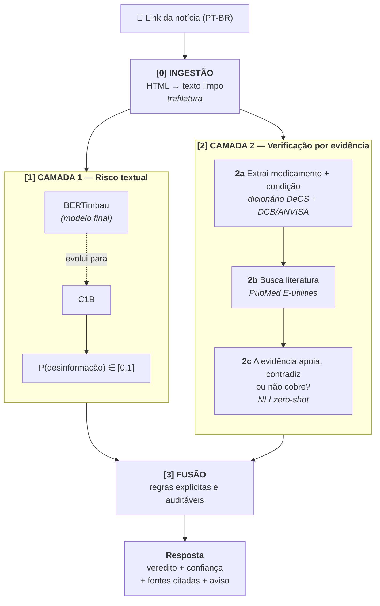

# Arquitetura do Sistema

Como o sistema transforma **um link de notícia** em um **veredito com evidências**.

## Visão geral

O usuário cola o link de uma notícia sobre saúde. O sistema extrai o texto, analisa
esse texto por **duas camadas independentes** e combina os dois resultados por regras
explícitas.

## As quatro etapas

### [0] Ingestão — do link ao texto

Baixa a página e extrai título, corpo, data e domínio, descartando menu, banner de
cookie, "leia também" e rodapé.

Usamos **`trafilatura`** em vez de um parser próprio porque portais de notícia
brasileiros variam muito de estrutura, e extração suja contamina as duas camadas
seguintes de uma vez. Esta é a etapa cuja dificuldade é mais subestimada, por isso é a
primeira a ser testada — contra 20 links reais de portais diferentes.

### [1] Camada 1 — Risco textual

Classificador supervisionado treinado em corpus rotulado de notícias em português.
Recebe o texto e devolve uma probabilidade de o conteúdo ser desinformação.

A evolução é deliberada, do simples para o complexo:

| Etapa | Modelo | Papel |
|---|---|---|
| Baseline | TF-IDF + Regressão Logística | Referência mínima. Rápido, interpretável, roda em CPU. Nenhum modelo posterior entra sem superá-lo. |
| Final | BERTimbau (`neuralmind/bert-base-portuguese-cased`) | Fine-tuning. Entende contexto e semântica, não só frequência de palavra. |

#### Como fazer o fine-tuning do BERTimbau

Substituir a cabeça de classificação do modelo pré-treinado e ajustar os pesos sobre o recorte de saúde PT-BR gerado na Task 5. A estrutura é `BertForSequenceClassification(num_labels=2)` sobre `neuralmind/bert-base-portuguese-cased`, treinada com a API `Trainer` do `transformers`.

| Decisão | Recomendação |
|---|---|
| Truncamento | 512 tokens — limite do BERT. Avaliar se título + lead já carregam o sinal antes de usar o texto completo. |
| Desbalanceamento | Pesos no `CrossEntropyLoss` ou `WeightedRandomSampler` — mesma razão do baseline. |
| Métrica de parada | F1 macro, nunca acurácia. Usar `load_best_model_at_end=True` com `metric_for_best_model="f1"`. |
| Avaliação OOD | Medir em portais **não vistos no treino** antes de declarar melhora sobre o baseline — detecta viés de fonte. |

!!! note "O baseline entra antes do BERTimbau"
    O fine-tuning só se justifica se as métricas do TF-IDF no recorte de saúde já forem conhecidas. Amershi et al. chamam isso de *no model before pipeline* — um modelo melhor num pipeline quebrado é invisível. Se o baseline já atingir F1 ≥ 0,80, avaliar se o custo de fine-tuning vale a margem.

!!! warning "Limitação fundamental desta camada"
    Um classificador treinado em corpus de fake news aprende **estilo de escrita**
    (sensacionalismo, caixa alta, apelo emocional), **não fatos**. Ele erra em
    alegações falsas bem redigidas — justamente o caso mais perigoso em saúde.

    Esta não é uma falha de implementação, é uma limitação do paradigma. A Camada 2
    existe exatamente para cobri-la. Amershi et al. descrevem o fenômeno como
    *mismatch between the real world and evaluation sets* (Seção II-C do artigo-base).

### [2] Camada 2 — Verificação por evidência

Enquanto a Camada 1 olha *como* a notícia foi escrita, a Camada 2 olha *o que ela
afirma*.

**2a — Extração da alegação.** Identifica no texto o par *medicamento + condição
clínica* por casamento com dicionário controlado, sem treinar um NER próprio:

- **[DeCS](https://decs.bvsalud.org/)** (Descritores em Ciências da Saúde, BIREME/BVS) — vocabulário trilíngue PT/EN/ES com 35.033 descritores, dos quais 31.110 vêm do MeSH.
- **[DCB/ANVISA](https://www.gov.br/anvisa/pt-br/assuntos/farmacopeia/dcb)** (Denominações Comuns Brasileiras) — nomenclatura oficial de princípios ativos no Brasil.

**A ponte PT↔EN.** A notícia está em português; o PubMed responde em inglês. O DeCS
resolve isso por ser trilíngue e mapear para MeSH: `"hidroxicloroquina"` →
`Hydroxychloroquine[MeSH]` vira uma query válida. É o que torna a Camada 2 viável sem
tradução automática nem custo de API.

**2b — Busca de evidência.** Consulta a [PubMed E-utilities](https://www.ncbi.nlm.nih.gov/books/NBK25501/)
(`esearch` + `efetch`), priorizando revisões sistemáticas e meta-análises, que ocupam o
topo da hierarquia de evidência.

**2c — Classificação de suporte.** Decide se a literatura recuperada **apoia**, **contradiz** ou **não cobre** a alegação, via NLI (*natural language inference*). A abordagem evolui em fases para não investir em dados antes de saber se são necessários:

| Fase | Abordagem | Entrega |
|---|---|---|
| **Fase 1 (PoC)** | Sem NLI — responde só **encontrou** ou **não cobre**, com força pelo tipo de estudo | Valida que o pipeline funciona ponta a ponta |
| **Fase 2a — zero-shot** | `MoritzLaurer/mDeBERTa-v3-base-xnli-multilingual-nli-2mil7`, sem treino adicional | Gratuito no Colab; mede se zero-shot basta antes de anotar dados |
| **Fase 2b — fine-tuning** | Fine-tuning do mDeBERTa em pares `(resumo, alegação, rótulo)` anotados | Apenas se o zero-shot for impreciso no domínio biomédico PT |

Para a Fase 2b, cada exemplo segue o formato NLI padrão: **premise** = resumo do artigo do PubMed, **hypothesis** = alegação extraída da notícia, **label** ∈ {entailment, contradiction, neutral}. A fonte de dados mais viável é o [MedNLI](https://physionet.org/content/mednli/1.0.0/) (inferência em linguagem médica) complementado por anotação manual de ~500 pares selecionados do PubMed.

### [3] Fusão — combinando os dois sinais

| Camada 2 (evidência) | Camada 1 (estilo) | Veredito |
|---|---|---|
| Contradiz | qualquer | **Sem base científica** — a evidência prevalece |
| Apoia | risco alto | **Base existe, mas a matéria exagera** |
| Apoia | risco baixo | **Com base científica** |
| Não cobre | qualquer | **Não foi possível verificar** (confiança baixa) |

**Por que regras e não um terceiro modelo.** Por duas razões. Primeiro, não existe
dado rotulado para treinar a fusão — seria um modelo sem supervisão possível. Segundo,
regras são auditáveis: o usuário consegue ver *por que* recebeu aquele veredito, o que
responde diretamente às perguntas de transparência levantadas em
[Guiding Questions](guiding-questions.md).

!!! danger "Ausência de evidência não é evidência de ausência"
    A última linha da tabela é a mais importante. Quando o PubMed não retorna nada, o
    sistema responde **"não foi possível verificar"** — nunca **"é falso"**. Um
    tratamento pode simplesmente não ter sido estudado ainda.

## Stack técnica

| Função | Tecnologia | Custo |
|---|---|---|
| Linguagem | Python 3.11 | — |
| Ingestão de notícias | `trafilatura`, `requests` | grátis |
| Manipulação de dados | `pandas` | grátis |
| Baseline e métricas | `scikit-learn` | grátis |
| Modelo final Camada 1 | `transformers` + PyTorch (BERTimbau) | grátis |
| Vocabulário médico | DeCS/MeSH + DCB da ANVISA | grátis |
| Busca de evidência | PubMed E-utilities | grátis, sem chave obrigatória |
| Inferência de suporte | mDeBERTa-v3 XNLI | grátis |
| Interface (PoC) | Streamlit | grátis |
| Interface (fase 2) | FastAPI + front dedicado | grátis |
| Experimentação | Jupyter / Google Colab | GPU gratuita |
| Documentação | MkDocs Material + GitHub Pages | grátis |
| CI | GitHub Actions | grátis |

**Restrição de projeto: orçamento zero.** Nenhum componente depende de API paga. Isso
não é só economia — força a Camada 2 a ser aprendizado de máquina de verdade em vez de
uma chamada a um LLM comercial.

**Por que Streamlit na PoC.** É Python puro: a equipe não precisa aprender JavaScript
para ter tela funcionando. A separação em API (FastAPI) fica para a fase 2, quando o
pipeline já estiver estável e valer a pena isolá-lo.

## Estratégia de construção: fatia vertical fina

A PoC constrói a **fatia mais estreita possível que atravessa as quatro etapas**, com
cada peça deliberadamente simples, em vez de aperfeiçoar uma etapa por vez.

Isso segue a recomendação central de Amershi et al. (Seção V-A, *end-to-end pipeline
support*) e tem uma razão prática: os problemas caros aparecem nas **junções** entre
etapas, não dentro delas. Descobrir na semana 2 que o PubMed responde em inglês é
barato; descobrir na semana 10 é fatal.

### Fases

| Fase | Entrega | Etapas |
|---|---|---|
| **1 — PoC** *(Challenge 1)* | Fatia vertical fina rodando ponta a ponta | Ingestão + baseline TF-IDF + PubMed + Streamlit |
| **2 — Modelo** | Qualidade preditiva | Dataset ampliado, fine-tuning do BERTimbau, NLI na Camada 2c, FastAPI |
| **3 — Produção** | Sustentação | Versionamento de dados, monitoramento, reingestão periódica |

### Frentes de trabalho

Quatro frentes paralelas desde o dia 1, uma por integrante:

| Frente | Responsabilidade | Guiding Question |
|---|---|---|
| **A — Dados** | Recorte de saúde do corpus PT-BR, coleta complementar, *datasheet* | GQ1, GQ2 |
| **B — Modelo** | Baseline, métricas, análise de erro, fine-tuning | GQ4 |
| **C — Evidência** | Dicionário DeCS + DCB, cliente PubMed, classificação de suporte | GQ5 |
| **D — Produto** | Ingestão de links, regras de fusão, interface, redação dos avisos | GQ3, GQ6, GQ7 |

As frentes se encontram numa **integração semanal**: cada uma entrega sua peça com
interface definida, e o pipeline completo roda de ponta a ponta toda semana, mesmo
imperfeito.

## Decisões pendentes de validação

| # | Decisão | Risco | Plano B |
|---|---|---|---|
| D1 | DeCS acessível para download em massa | Bloqueia a ponte PT↔EN | MeSH direto + dicionário PT manual dos ~50 fármacos mais citados |
| D2 | Recorte de saúde do corpus PT-BR tem volume suficiente | Modelo fraco por falta de dado | Coleta complementar em agências de checagem |
| D3 | NLI zero-shot funciona em texto biomédico em português | Camada 2c imprecisa | Heurística por tipo de estudo (revisão sistemática = forte) |
| D4 | `trafilatura` extrai bem dos portais BR alvo | Contamina as duas camadas | Regras por domínio nos 5 portais mais frequentes |

Cada uma é validada por uma tarefa curta na primeira semana. São hipóteses, não
suposições — e é assim que estão sendo tratadas.
