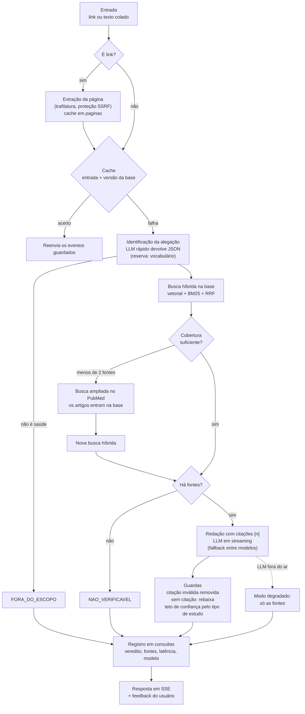

# Arquitetura

Como o sistema transforma **uma alegação de saúde** (um link de notícia ou um texto
colado) em **um veredito com fontes citadas**.

O sistema é um RAG (*Retrieval-Augmented Generation*): primeiro recupera estudos
científicos relevantes numa base própria; depois um modelo de linguagem redige a
resposta **usando apenas esses estudos**, e regras determinísticas conferem o que ele
escreveu. As decisões estão registradas uma a uma nos [ADRs](adr/index.md).

## Visão geral: uma consulta

```mermaid
flowchart TD
    E["Entrada<br/>link ou texto colado"] --> T{"É link?"}
    T -- sim --> X["Extração da página<br/>(trafilatura, proteção SSRF)<br/>cache em <i>paginas</i>"]
    T -- não --> C
    X --> C{"Cache<br/>entrada + versão da base"}
    C -- acerto --> R["Reenvia os eventos guardados"]
    C -- falha --> A["Identificação da alegação<br/>LLM rápido devolve JSON<br/>(reserva: vocabulário)"]
    A -- "não é saúde" --> F["FORA_DO_ESCOPO"]
    A --> B["Busca híbrida na base<br/>vetorial + BM25 + RRF"]
    B --> S{"Cobertura<br/>suficiente?"}
    S -- "menos de 2 fontes" --> V["Busca ampliada no PubMed<br/>os artigos entram na base"]
    V --> B2["Nova busca híbrida"]
    S -- sim --> W
    B2 --> W{"Há fontes?"}
    W -- não --> N["NAO_VERIFICAVEL"]
    W -- sim --> L["Redação com citações [n]<br/>LLM em streaming<br/>(fallback entre modelos)"]
    L --> G["Guardas<br/>citação inválida removida<br/>sem citação: rebaixa<br/>teto de confiança pelo tipo de estudo"]
    G --> D["Registro em <i>consultas</i><br/>veredito, fontes, latência, modelo"]
    N --> D
    F --> D
    L -. "LLM fora do ar" .-> M["Modo degradado:<br/>só as fontes"]
    M --> D
    D --> O["Resposta em SSE<br/>+ feedback do usuário"]
```

O sinal de estilo do BERTimbau (ver [ADR 0009](adr/0009-bertimbau-sinal-secundario.md))
roda em paralelo à identificação da alegação, quando está disponível, e aparece como
um indicador à parte. Não entra no veredito.

## Visão geral: dados offline

```mermaid
flowchart LR
    P["PubMed E-utilities"] --> I["scripts/ingere_pubmed.py<br/>(workflow semanal)"]
    I --> J["dados/base/pubmed.jsonl<br/>+ manifesto.json (SHA-256)<br/>versionados no git"]
    J --> K["scripts/constroi_base.py<br/>embeddings + índice FTS5"]
    K --> Q["SQLite: vof.db"]
    Q --> M["Imagem Docker<br/>(banco construído no build)"]
    M --> H["Hugging Face Space"]
    H -. "consultas, páginas e artigos<br/>da busca ao vivo" .-> Q2["vof.db em execução<br/>(zera no reinício)"]
```

O JSONL é a fonte da verdade da base. O banco é **derivado** dele e pode ser
reconstruído a qualquer momento. O hash do manifesto entra na chave de cache e aparece
em `/api/saude`, então cada resposta é rastreável até a versão da base que a gerou.

## Componentes

### Ingestão da página (`ingestao.py`)

Baixa o link e extrai título e corpo com `trafilatura`. O servidor só baixa URLs
`http(s)` que resolvem para IPs públicos, inclusive em cada redirecionamento (no máximo
5), e recusa páginas acima de 5 MB. Isso evita que o serviço sirva de ponte para a rede
interna (SSRF).

**Por quê:** o produto aceita links, e links são entrada hostil por natureza. Quando a
página não abre (login, paywall, bloqueio de robô), o sistema não tenta adivinhar: pede
que o usuário cole o texto. O texto extraído fica em cache na tabela `paginas`.

### Identificação da alegação (`rag.py`, `entender_alegacao`)

Um modelo pequeno (`LLM_MODELO_RAPIDO`) recebe o texto e devolve um JSON com: se o
assunto é saúde, a alegação em português, a mesma alegação em inglês científico e uma
consulta de PubMed com dois conceitos (intervenção AND condição). Se o LLM não está
configurado ou falha, entra uma reserva: o casamento por dicionário de `vocabulario.py`
(23 medicamentos e 15 condições em `dados/vocabulario_seed.csv`).

**Por quê:** a versão anterior só funcionava para pares do dicionário. O LLM generaliza
a extração para qualquer alegação, e o dicionário continua como plano B auditável.
Texto que não é alegação de saúde recebe `FORA_DO_ESCOPO` sem gastar busca nem redação.

### Banco (`banco.py`)

Um único arquivo SQLite com três papéis: `documentos` (resumos, embeddings e índice
FTS5), `consultas` (cada análise, com veredito, fontes, latência, modelo, se veio do
cache ou de busca ao vivo, e o feedback) e `paginas` (cache de links). Decisão em
[ADR 0002](adr/0002-sqlite-busca-vetorial-exata.md).

### Embeddings (`embeddings.py`)

`paraphrase-multilingual-MiniLM-L12-v2` rodando em CPU por ONNX (`fastembed`), sem
PyTorch. É multilíngue de propósito: a pergunta chega em português e a literatura está
em inglês, e os dois idiomas ficam no mesmo espaço vetorial. Decisão em
[ADR 0003](adr/0003-embeddings-multilingues-onnx.md).

### Recuperação (`recuperacao.py`)

Busca híbrida. A vetorial (cosseno exato em numpy) entende paráfrase e cruza idiomas,
mas confunde fármacos de nome parecido. A lexical (BM25 do FTS5) acerta o nome exato,
mas não sabe que "pressão alta" é *hypertension*. As duas listas (30 candidatos cada)
são fundidas por Reciprocal Rank Fusion (k = 60), que dispensa calibrar escalas de
score diferentes. A pontuação final recebe um bônus pela hierarquia de evidência:
x1,20 para revisão sistemática e meta-análise, x1,08 para ensaio randomizado. A busca
leva cerca de 10 ms na base atual (medido pela equipe).

Depois da busca, `selecionar` filtra os 15 melhores candidatos. Prefere os que contêm
todos os conceitos da consulta de PubMed e têm similaridade de cosseno de pelo menos
`VOF_SIMILARIDADE_MINIMA` menos 0,12; se não há nenhum, exige a similaridade mínima
mais 0,12. Ficam no máximo 5 fontes por resposta.

### Busca ampliada (`evidencia.py`, `base.py`)

Se a seleção devolve menos de 2 fontes e a busca ao vivo está ligada, o sistema consulta
o PubMed na hora: primeiro só revisões sistemáticas, meta-análises e ensaios
randomizados (sem estudos só em animais) e, se nada vier, qualquer tipo. Os artigos
encontrados são indexados na base com origem `ao_vivo`, e a busca é refeita. A base
cresce com o uso. Falha de rede vira lista vazia: o sistema responde com o que já tinha.
Decisão em [ADR 0006](adr/0006-base-em-lote-com-busca-ao-vivo.md).

### Cliente de LLM (`llm.py`)

Cliente HTTP mínimo (`httpx`) para qualquer API compatível com a de chat da OpenAI, com
streaming. Os modelos de `LLM_MODELOS` são tentados em ordem: se um responde 429 (cota
gratuita esgotada) ou erro de servidor, o próximo assume, desde que nenhum texto tenha
sido entregue ainda. Blocos `<think>` de modelos de raciocínio são removidos. Decisão em
[ADR 0004](adr/0004-cliente-openai-compativel-groq.md).

### Redação e guardas (`rag.py`)

O prompt de veredito manda usar **exclusivamente** as fontes numeradas, citar cada frase
factual no formato `[n]`, tratar falta de estudo como `INCONCLUSIVA` e escrever para
leigo, sem orientação médica individual. A saída tem um cabeçalho fixo (`VEREDITO`,
`CONFIANCA`, `RESUMO`), um separador `---` e o texto. As guardas rodam sobre essa saída,
sem depender do modelo:

- `FiltroDeCitacoes` remove, durante o streaming, citações `[n]` que não existem na
  lista de fontes.
- `aplicar_guardas`: veredito afirmativo (`APOIADA`, `CONTESTADA`, `EXAGERADA`) sem
  nenhuma citação válida vira `INCONCLUSIVA` com confiança baixa.
- Teto de confiança pelo tipo de estudo citado: se as fontes citadas são todas fracas
  (nem revisão nem ensaio randomizado), o teto é `baixa`; se a mais forte é um ensaio
  randomizado, `media`; `alta` exige ao menos uma revisão sistemática ou meta-análise
  entre as citadas.

Vereditos possíveis (`ROTULOS`): `APOIADA`, `CONTESTADA`, `EXAGERADA`, `INCONCLUSIVA`,
`NAO_VERIFICAVEL` e `FORA_DO_ESCOPO`. Os dois últimos nunca vêm do LLM: são decididos
pelo código (sem fontes encontradas, ou assunto fora de saúde). Decisão em
[ADR 0007](adr/0007-guardas-deterministicas.md).

### Cache e modo degradado (`rag.py`)

A chave de cache é o SHA-256 de `versão da base + entrada normalizada`. Dentro de
`VOF_CACHE_HORAS` (168 por padrão), a mesma entrada recebe de volta os eventos da
resposta anterior, sem nova chamada ao LLM. Mudou a base, mudou a chave. Respostas em
modo degradado não são guardadas no cache.

Sem `LLM_API_KEY`, ou se todos os modelos falham, o sistema mostra as fontes recuperadas
com veredito `INCONCLUSIVA` e o aviso "Modo degradado".

### API e front (`api.py`, `web/index.html`)

FastAPI com resposta em streaming por Server-Sent Events, limite de requisições por
cliente e o front estático servido na raiz. O front é um único HTML, sem etapa de
build. Contrato em [API](api.md); decisão em
[ADR 0005](adr/0005-fastapi-sse-front-estatico.md).

### Sinal de estilo (`sinal_estilo.py`)

O BERTimbau treinado pelo grupo continua no repositório, com seu model card
(`modelos/cards/bertimbau.json`) e o gate em `model_card.py`. Só é carregado se
PyTorch e os pesos estiverem disponíveis. Se carregar, a interface mostra um "sinal de
estilo do texto". Ele não decide o veredito. Decisão em
[ADR 0009](adr/0009-bertimbau-sinal-secundario.md).

## Stack

| Função | Tecnologia |
|---|---|
| Linguagem | Python 3.11 |
| API | FastAPI + uvicorn, Server-Sent Events |
| Front | HTML e JavaScript estáticos, sem build |
| Banco, busca lexical, cache e registro | SQLite com FTS5 |
| Busca vetorial | numpy (cosseno exato em memória) |
| Embeddings | `fastembed` (ONNX), `paraphrase-multilingual-MiniLM-L12-v2` |
| LLM | API compatível com OpenAI via `httpx` (Groq por padrão; Gemini ou Ollama) |
| Extração de links | `trafilatura` |
| Literatura | PubMed E-utilities |
| Classificador opcional | BERTimbau (PyTorch, `transformers`), só para o sinal de estilo |
| Contêiner e hospedagem | Docker; Hugging Face Space (SDK Docker) |
| CI/CD | GitHub Actions |
| Documentação | MkDocs Material + GitHub Pages |

As dependências ficam separadas em `requirements.txt` (runtime leve),
`requirements-treino.txt` (PyTorch e afins) e `requirements-dev.txt` (testes).

## O que mudou e por quê

Esta seção é o registro de processo que o método CBL pede: documentar, refletir,
compartilhar. A versão anterior não deu certo, e vale dizer como e por quê.

A comparação lado a lado, com os benefícios e o comportamento atual, está em
[Antes e depois](antes-e-depois.md).

**A versão anterior.** Um app Streamlit. A cada consulta, o sistema baixava a página,
passava o texto por um BERTimbau (classificador de estilo), procurava um par
medicamento + condição num dicionário de 38 termos, consultava o PubMed ao vivo (limite
de 3 requisições por segundo) e rodava um modelo NLI mDeBERTa zero-shot, em CPU, sobre
até 10 resumos. Regras de fusão combinavam os sinais. Não havia banco nem persistência.
A demo rodava num túnel temporário do Cloudflare, a partir de um notebook do Colab.

**O que falhou.**

- **Lento.** Cada resposta levava dezenas de segundos: busca ao vivo com limite de
  taxa, mais NLI em CPU sobre vários resumos, tudo no caminho da requisição.
- **Estreito.** Só funcionava para os 38 termos do dicionário. Qualquer alegação fora
  dele caía em "não foi possível verificar".
- **Pouco convincente.** O NLI zero-shot errava em texto biomédico, que era a hipótese
  D3 da nossa lista de decisões pendentes. E a resposta final era um rótulo de regra,
  sem texto que um leigo pudesse ler.
- **Mediu a coisa errada.** O BERTimbau teve F1 macro alto no teste (0,96 no model card
  atual), mas o produto não servia. O classificador aprende **estilo de portal**, não
  fato: as falsas vinham quase todas de um único site. Uma alegação falsa bem redigida
  passa, e uma verdadeira mal escrita é marcada.
- **Frágil para demonstrar.** Sem persistência, sem registro de uso e com um link que
  mudava a cada execução do Colab.

**Armadilhas que isso ilustra** (discutidas em aula):

- **Métrica de ML alta não é problema resolvido.** O F1 do BERTimbau era alto e o
  produto, inútil. A métrica respondia a outra pergunta.
- **Métrica certa no dataset errado.** O Fake.br cobre 2016 a 2018, quase não trata de
  saúde (3 notícias com medicamento e condição no recorte, ver [Dados](dados.md)) e não
  tem COVID-19. F1 alto num corpus que não é o do problema não prova nada sobre o
  problema.
- **Otimizar o proxy.** Treinamos e comparamos modelos (TF-IDF, BERTimbau) para subir um
  número que era proxy do que o usuário precisa: saber se a alegação tem respaldo
  científico. Quem responde a isso é a evidência, e ela estava na camada menos
  desenvolvida.

**O que fizemos.** Trocamos o desenho por um RAG: a evidência virou o centro, a base é
ingerida em lote e indexada, e a pergunta "isso tem respaldo?" passou a ser respondida
por um LLM que só pode falar o que as fontes dizem, com guardas conferindo. O BERTimbau
ficou como sinal secundário opcional. As decisões estão nos [ADRs](adr/index.md).

**O que ganhamos e o que perdemos.** Ganhamos cobertura de alegações além do
dicionário, resposta em streaming, texto legível com citações, um banco com registro de
uso e uma demo hospedada. Perdemos a independência de serviços externos: agora
dependemos de um LLM de terceiros e da cota gratuita dele. Os números de qualidade do
sistema novo são medidos por `scripts/avalia_rag.py`; os resultados ficam em
[Avaliação](avaliacao.md).

## MLOps

O artigo-base é Kreuzberger, Kühl e Hirschl, *Machine Learning Operations (MLOps):
Overview, Definition, and Architecture* (IEEE Access, 2023). Ele foi apresentado em aula
com a recomendação de justificar cada componente adotado. Para uma equipe de quatro
pessoas, com orçamento zero e um prazo curto, adotamos uma versão leve e dizemos por que
não adotamos o resto.

### Princípios

| Princípio | Adotado | Onde está | Não adotado, e por quê |
|---|---|---|---|
| P1 CI/CD | `ci.yml` roda os testes offline (`pytest -m "not rede"`) a cada push; `deploy-app.yml` publica o Space | `.github/workflows/` | Há um único ambiente, sem homologação. |
| P2 Orquestração de workflow | Agendamento semanal da ingestão pelo GitHub Actions | `ingestao-base.yml` | Sem orquestrador dedicado (Airflow, Kubeflow): são poucos passos lineares, um agendador resolve. |
| P3 Reprodutibilidade | Versões fixadas nos `requirements*.txt`; banco reconstruído do JSONL com um comando; Dockerfile | `requirements*.txt`, `scripts/constroi_base.py`, `Dockerfile` | O LLM de terceiros não é reprodutível: o provedor pode atualizar o modelo. Mitigação parcial: temperatura baixa e registro do modelo usado em cada consulta. |
| P4 Versionamento | Código, base de conhecimento (JSONL) e model card no git; manifesto com SHA-256 | `dados/base/`, `modelos/cards/` | Sem DVC: o JSONL é texto e cabe no git. Os pesos do BERTimbau ficam fora do git, no Hub. |
| P5 Colaboração | Repositório único, branches, ADRs e documentação no repositório | `docs/adr/`, `docs/` | Sem ferramenta de experimentos compartilhada. |
| P6 Treino e avaliação contínuos | Gate de qualidade do classificador opcional; avaliação do RAG por script | `scripts/verifica_gate.py`, `treino-gate.yml`, `scripts/avalia_rag.py` | O RAG não treina nada, então não há retreino contínuo. O que se atualiza é a base, toda semana. |
| P7 Metadados de ML | Model card com métricas, hashes dos dados e do artefato; manifesto da base; cada consulta registra modelo e latência | `modelos/cards/`, `dados/base/manifesto.json`, tabela `consultas` | Sem MLflow nem armazenamento de experimentos. |
| P8 Monitoramento contínuo | `GET /api/metricas` (latência p50 e p95, vereditos, cache, busca ao vivo) e `GET /api/saude` | `api.py`, `banco.py` (`metricas`) | Sem alertas automáticos nem painel externo. Alguém precisa olhar. |
| P9 Ciclos de feedback | Feedback por resposta, gravado em `consultas.feedback`; consultas com busca ao vivo apontam lacunas da base | `POST /api/feedback`, [Operação](operacao.md) | O ciclo é manual: uma pessoa lê os sinais e decide ampliar o vocabulário ou ajustar prompts. |

### Componentes

| Componente | Adotado | Onde está | Não adotado, e por quê |
|---|---|---|---|
| C1 CI/CD | GitHub Actions | `.github/workflows/` | — |
| C2 Repositório de código | GitHub | o próprio repositório | — |
| C3 Orquestração de workflow | Só o agendamento do GitHub Actions | `ingestao-base.yml` | Sem orquestrador dedicado, ver P2. |
| C4 Feature store | Nenhum | — | Não há features compartilhadas: o RAG consome texto e embeddings calculados na construção do banco. |
| C5 Infraestrutura de treino | Máquina local ou Colab, só para o classificador opcional | `scripts/treina_bert.py` | Sem cluster nem GPU dedicada. O RAG não treina. |
| C6 Registro de modelos | Model card em JSON no git; pesos no Hugging Face Hub | `modelos/cards/`, `scripts/publica_modelo.py` | Sem registro remoto (MLflow): um JSON legível em diff basta para um modelo. |
| C7 Repositório de metadados | Model card, manifesto da base e tabela `consultas` | ver P7 | Sem armazenamento dedicado. |
| C8 Serviço de modelo | FastAPI em contêiner Docker no Hugging Face Space | `api.py`, `Dockerfile` | Sem Kubernetes: uma réplica de uma imagem, num host gratuito, não justifica. |
| C9 Monitoramento | Endpoint de métricas sobre o próprio SQLite | `banco.py` (`metricas`) | Sem Prometheus nem Grafana. |

### Papéis

O artigo define sete papéis (R1 a R7). Com quatro pessoas, cada uma acumula vários. O
mapeamento abaixo é por frente de trabalho, não por nome.

| Papel | Quem exerce |
|---|---|
| R1 Interessado de negócio | Os usuários finais e a banca da disciplina; a equipe traduz o problema nas Guiding Questions. |
| R2 Arquiteto de solução | Decisão coletiva, registrada em ADRs; quem propõe a decisão a escreve. |
| R3 Cientista de dados | Frente de modelo e avaliação: classificador opcional, conjunto de alegações com gabarito, prompts. |
| R4 Engenheiro de dados | Frente de dados e evidência: ingestão do PubMed, vocabulário, construção da base, datasheets. |
| R5 Engenheiro de software | Frente de produto: API, front, extração de links, guardas. |
| R6 Engenheiro DevOps | Frente de infraestrutura: Docker, workflows, deploy no Space. |
| R7 Engenheiro de ML (MLOps) | Acumulado entre as frentes de modelo e infraestrutura: gate, model card, monitoramento. |

## Requisitos não funcionais

### Confiabilidade

- **O LLM erra.** As guardas reduzem o dano (citação inexistente removida, afirmação sem
  citação rebaixada, confiança limitada pelo tipo de estudo), mas não o eliminam: o
  modelo pode citar uma fonte real e interpretá-la mal. Por isso o texto sempre
  acompanha as fontes com link, e o usuário pode conferir.
- **O LLM cai ou estoura a cota.** Primeiro o fallback tenta o próximo modelo da lista.
  Se todos falham, o sistema entra em modo degradado e mostra as fontes recuperadas
  com aviso.
- **A página não abre.** O usuário recebe uma mensagem pedindo que cole o texto. Nada é
  inventado a partir de uma página que não foi lida.
- **O PubMed está fora.** A busca ampliada devolve lista vazia e a resposta usa o que a
  base local tem.
- **Não há estudo sobre a alegação.** Resposta `NAO_VERIFICAVEL`, com o texto explícito
  de que ausência de estudo não prova que a alegação é falsa.
- **Erro inesperado.** A API envia um evento `erro` genérico e registra a exceção no log.
- **Disco não persistente.** No plano gratuito do Space, o registro de consultas zera a
  cada reinício. A base de conhecimento é reconstruída na imagem.

### Escalabilidade

O desenho serve para demonstração e uso leve. O que muda de 10 para 10 mil consultas por
dia:

- **Cota do LLM.** É o primeiro gargalo. Limites do plano gratuito do Groq na data da
  consulta (07/10/2026), sujeitos a mudança: 30 requisições por minuto; por dia, cerca
  de 100 mil tokens no `llama-3.3-70b-versatile`, 200 mil no `openai/gpt-oss-120b` e
  500 mil no `llama-3.1-8b-instant`. A lista de modelos com fallback soma essas cotas.
  Cada consulta nova usa duas chamadas (identificação da alegação e redação). Com muito
  mais consultas por dia, é preciso um plano pago ou outro provedor.
- **Cache.** Consultas repetidas não chamam o LLM. Ajuda quando muita gente cola a mesma
  corrente de WhatsApp, e nada quando cada entrada é única.
- **SQLite de processo único.** Uma réplica, uma conexão protegida por trava. A busca
  vetorial exata compara a consulta com todos os embeddings em memória: funciona bem em
  milhares de documentos e deixa de fazer sentido em milhões. Várias réplicas
  exigiriam outro armazenamento.
- **Limite por cliente.** `VOF_LIMITE_POR_MINUTO` (12 por padrão) protege a cota
  compartilhada de um único usuário, mas fica em memória e vale por processo.
- **PubMed.** O cliente espaça as requisições para respeitar 3 por segundo sem chave;
  com `NCBI_API_KEY` o intervalo cai para respeitar 10 por segundo.

### Manutenibilidade

- Um módulo por responsabilidade, com docstrings que explicam o porquê.
- O orquestrador (`rag.py`) recebe as dependências por um objeto `Servico`, o que
  permite testar com LLM, PubMed e extração simulados. A suíte `pytest -m "not rede"`
  roda offline no CI.
- Dependências fixadas e separadas por uso (runtime, treino, desenvolvimento).
- Decisões em ADRs; datasheets da base e do corpus de treino em [Dados](dados.md).

### Adaptabilidade

- **Base nova:** ingestão semanal pelo workflow `ingestao-base.yml`, que commita o JSONL
  atualizado.
- **Alegação fora da base:** busca ao vivo no PubMed, cujos artigos passam a fazer parte
  da base local.
- **Troca de provedor de LLM:** três variáveis de ambiente, sem tocar no código
  ([Operação](operacao.md)).
- **Novos medicamentos e condições:** acrescentar linhas a `dados/vocabulario_seed.csv`
  e rodar a ingestão.
- **Limite honesto:** o vocabulário define o que a ingestão em lote cobre. Fora dele, a
  qualidade depende da busca ao vivo.
